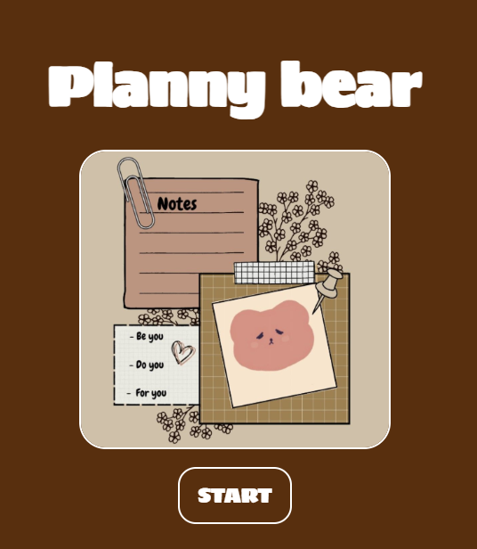
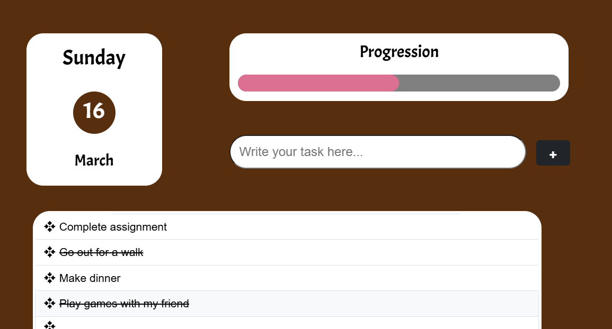
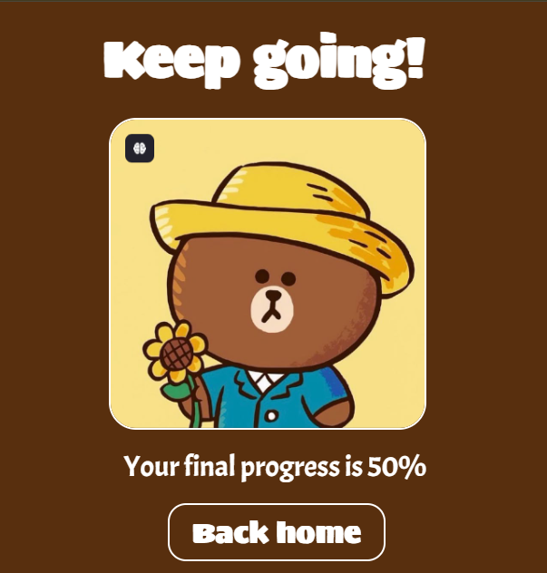

🐻 Planny Bear - Your Cute To-Do List 📝💖

Planny Bear is a simple and interactive to-do list website built using HTML, CSS, and JavaScript. It helps you stay organized while keeping things fun and visually appealing! 🎀✨

🌟 Features

✅ Add tasks by clicking the "Add" button.
🗑️ Click on a task to mark it as done (it will disappear when cut).
❌ No editing option yet (future update).
📊 "Finish Day" button to track your daily progress.

🚀 How to Use

Open the index.html file in a browser.
Type a task and click Add to save it.
Click on a task to mark it as done (it will disappear).
Click Finish Day to track your progress.

📂 Project Structure

PlannyBear/
│── Assets/           
│   ├── CSS/        
│   ├── Images/      
│   ├── script/      
│
│── pages/           
│   ├── end.html      
│   ├── main.html     
│   ├── index.html  

🛠️ Technologies Used

HTML5 for structure
CSS3 for styling
JavaScript (ES6) for interactivity

📷 Preview

📜 License

This project is open-source. Feel free to use and modify it! 🐻💖
